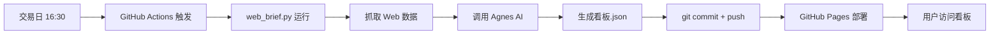

# StockExpert 每日看板自动化系统

> **零成本的 A 股每日简报系统** - 基于 GitHub Actions + Agnes AI，每日收盘后自动生成结构化研判报告，部署到 GitHub Pages

[](LICENSE)
[](https://www.python.org/)
[](https://github.com/your-username/stock-automation/actions)

---

## 📋 目录

- [功能特点](#功能特点)
- [系统架构](#系统架构)
- [快速开始](#快速开始)
- [配置说明](#配置说明)
- [数据源](#数据源)
- [内容更新流程](#内容更新流程)
- [本地开发](#本地开发)
- [故障排查](#故障排查)
- [性能指标](#性能指标)
- [技术规范](#技术规范)
- [常见问题](#常见问题)

---

## 功能特点

### 核心功能

- ✅ **自动化运行**: 每个交易日收盘后自动运行（北京时间 16:30）
- ✅ **零成本部署**: 免费数据源 + GitHub Actions + GitHub Pages
- ✅ **结构化研判**: 符合 `dashboard-contract` 的 JSON 格式看板
- ✅ **数据可追溯**: 所有判断字段包含 `source` + `reasoning`
- ✅ **降级不中断**: AI 调用失败时自动生成降级看板
- ✅ **纯静态前端**: 无需后端，原生 HTML/CSS/JS

### 研判维度

系统基于**右侧交易体系**，采用漏斗式研判策略：

1. **大盘强度判断** (`market_regime.strength`)
   - 强度: `strong` / `neutral` / `weak`
   - 指数: 上证/深成/创业板指价格和涨跌幅
   - 涨跌家数、涨停跌停家数

2. **题材四阶段判定** (`themes[].stage`)
   - 阶段: `launching`（启动）/ `trending`（趋势中）/ `climax`（高潮）/ `fading`（退潮）
   - 强度: `high` / `mid` / `low`
   - 催化因素、相关中军代码

3. **中军候选筛选** (`midcaps[]`)
   - 位置评估: `good`（好位置）/ `ok`（可）/ `high`（偏高谨慎）/ `avoid`（排除）
   - 趋势状态: `intact`（完整）/ `broken`（破位）/ `watch`（观察）
   - 3 日观察区间: `{low, high, reasoning}`

---

## 系统架构

```
┌─────────────────────────────────────────────────────────────┐
│  GitHub Actions (ubuntu-latest)                              │
│  触发器: 每个交易日 北京时间 16:30 (UTC 08:35) / 手动触发     │
│                                                             │
│  ┌─────────────── web_brief.py (Python 3.11, 仅标准库) ───┐ │
│  │  1. 交易日历过滤 (周末 + 内置节假日集合)               │ │
│  │  2. build_web_context() 抓取公开 Web 财经信息          │ │
│  │       ├─ 腾讯行情接口 qt.gtimg.cn (指数, 优先)         │ │
│  │       ├─ 东财 push2 接口 (指数, 备用)                 │ │
│  │       ├─ 新浪行业板块名录                              │ │
│  │       ├─ 东财盘中快讯接口                              │ │
│  │       └─ 博查 Bocha Web 搜索 (收评/题材/涨跌家数)     │ │
│  │  3. call_agnes() 调用 Agnes AI (OpenAI 兼容) 做研判   │ │
│  │  4. 用模型给出的个股 code 反查腾讯实时行情(回填硬数字) │ │
│  │  5. assemble() 组装符合 dashboard-contract 的看板.json │ │
│  │  6. write_manifest() 生成 manifest.json               │ │
│  └─────────────────────────────────────────────────────────┘ │
│       │ 落盘: dashboard/data/YYYY-MM/YYYY-MM-DD/看板.json      │
│       │ 落盘: dashboard/manifest.json                          │
│       ▼                                                      │
│  git commit + push (github-actions[bot])                     │
│       ▼                                                      │
│  GitHub Pages 部署 (dashboard/ 整目录)                       │
└─────────────────────────────────────────────────────────────┘
        ▼
┌─────────────────────────────────────────────────────────────┐
│  用户浏览器  →  dashboard/index.html (纯静态, 无后端)        │
│       fetch manifest.json → 左侧日期列表                    │
│       fetch 看板.json    → 右侧大盘/题材/中军/数据质量      │
└─────────────────────────────────────────────────────────────┘
```

### 目录结构

```
stockexpert-daily-brief/
├── web_brief.py              # 主脚本（658 行）
├── requirements.txt          # 空依赖注解（仅用标准库）
├── README.md                 # 本文档
├── SPEC.md                   # 技术规范
├── 项目审核文档.md            # 详细架构审核
├── 策略评估报告.md            # 策略评估
├── .gitignore                # Git 忽略配置
├── dashboard/                # GitHub Pages 目录
│   ├── index.html            # 看板前端（纯静态）
│   ├── manifest.json         # 前端枚举清单（脚本生成）
│   ├── .nojekyll             # GitHub Pages 配置
│   └── data/                 # 历史看板数据
│       └── YYYY-MM/
│           └── YYYY-MM-DD/
│               ├── 看板.json       # 标准 schema 看板
│               └── web_context.txt # (降级时) 原始抓取上下文
└── .github/                  # 模块级 GitHub 配置（保留在根目录）
    └── workflows/
        └── daily-brief.yml   # CI/CD 配置
```

---

## 快速开始

### 1. 本地运行

```bash
# 进入模块目录
cd stockexpert-daily-brief

# 配置环境变量
export AGNES_API_KEY="你的 Agnes AI Key"
export AGNES_BASE_URL="https://api.agnes-ai.com/v1"
export AGNES_MODEL="agnes-text"
export BOCHA_API_KEY="你的博查 API Key"  # 可选

# 预览模式（仅打印，不落盘）
python web_brief.py --dry-run

# 生成当天看板
python web_brief.py

# 指定交易日重跑
python web_brief.py --trade-date 2026-07-16
```

### 2. 本地预览看板

```bash
# 启动本地 HTTP 服务器
cd dashboard
python -m http.server 8000

# 打开浏览器访问
# http://127.0.0.1:8000/
```

### 3. GitHub 配置

#### 3.1 配置 Secrets

在仓库 `Settings → Secrets and variables → Actions → New repository secret`:

| Secret 名称 | 说明 | 必填 | 示例 |
| --- | --- | --- | --- |
| `AGNES_API_KEY` | Agnes AI 的 API Key | ✅ 是 | `sk-...` |
| `AGNES_BASE_URL` | Agnes API 网关地址 | ❌ 否 | `https://api.agnes-ai.com/v1` |
| `AGNES_MODEL` | 文本模型名 | ❌ 否 | `agnes-text` |
| `BOCHA_API_KEY` | 博查 AI 搜索 Key | ❌ 否 | `...` |

#### 3.2 启用 GitHub Pages

1. 进入仓库 `Settings → Pages`
2. 设置 `Build and deployment → Source: GitHub Actions`
3. Workflow 运行后自动部署到 `https://your-username.github.io/stock-automation/`

#### 3.3 手动触发运行

在 GitHub Actions 页面选择 `daily-brief` workflow，点击 `Run workflow`，可选指定 `trade_date`。

---

## 配置说明

### Workflow 配置

`.github/workflows/daily-brief.yml`:

```yaml
on:
  schedule:
    - cron: "35 8 * * 1-5"  # UTC 08:35 = 北京时间 16:30
  workflow_dispatch:
    inputs:
      trade_date:
        description: '指定交易日 (YYYY-MM-DD)'
        required: false
```

### 交易日历配置

内置 2026 年 A 股官方休市日（来源：沪深北交易所 2025-12-22 公告）：

```python
HOLIDAYS = {
    # 元旦
    "2026-01-01", "2026-01-02", "2026-01-03",
    # 春节
    "2026-02-15", "2026-02-16", ..., "2026-02-23",
    # 清明节、劳动节、端午节、中秋节、国庆节...
}
```

**注意**: 2027 年及以后需按当年公告补充。

---

## 数据源

### 主要数据源

| 数据源 | 用途 | 优先级 | 接口 |
| --- | --- | --- | --- |
| 腾讯行情 API | 指数/个股实时行情 | 优先 | `qt.gtimg.cn` |
| 东财 push2 API | 指数行情 | 备用 | `push2.eastmoney.com` |
| 新浪行业板块 | 板块名录 | - | - |
| 东财盘中快讯 | 盘中新闻 | - | - |
| 博查 Bocha Web 搜索 | 收评/题材/涨跌家数 | - | - |

### 数据质量保障

- ✅ **数字不编造**: 所有行情数字来自真实接口，缺失填 `null`
- ✅ **判断可追溯**: 每个字段包含 `source`（数据来源 URL）和 `reasoning`（2-5 句因果链）
- ✅ **结构化回填**: 指数行情从真实接口直接回填，绕过模型回读丢失风险
- ✅ **降级不中断**: AI 调用失败 → 写"数据不可用"降级看板 + 保留 `web_context.txt`

---

## 内容更新流程

### 自动化流程（推荐）



### 手动更新流程

1. **修改策略** (`SYSTEM_PROMPT`):
   ```python
   # 修改 web_brief.py 中的 SYSTEM_PROMPT
   # 例如：调整阶段判定标准、筛选条件等
   ```

2. **本地测试**:
   ```bash
   python web_brief.py --dry-run
   ```

3. **提交更改**:
   ```bash
   git add web_brief.py
   git commit -m "feat: 调整策略规则"
   git push
   ```

4. **手动触发运行**:
   - GitHub Actions 页面 → `Run workflow`
   - 或等待下一个交易日自动运行

---

## 本地开发

### 开发环境设置

```bash
# 克隆项目
git clone https://github.com/your-username/stock-automation.git
cd stock-automation/stockexpert-daily-brief

# 配置环境变量（建议使用 .env 文件）
export AGNES_API_KEY="..."
export AGNES_BASE_URL="..."
export AGNES_MODEL="..."
export BOCHA_API_KEY="..."

# 运行测试（当前主要依赖 E2E 测试）
python web_brief.py --dry-run
```

### 代码风格

- **语言**: Python 3.11+，仅使用标准库
- **命名**: 函数 `snake_case`，常量 `UPPER_CASE`
- **文档**: 关键函数使用 docstring
- **错误处理**: 使用 `try-except` 捕获外部接口异常

### 主要函数

```python
def build_web_context(trade_date: dt.date) -> tuple[str, list[dict], dict]:
    """构建 Web 上下文（指数 + 板块 + 快讯 + 搜索）"""
    ...

def call_agnes(system_prompt: str, context: str) -> dict | None:
    """调用 Agnes AI 做综合研判（失败返回 None）"""
    ...

def assemble(raw: dict, idx_struct: dict, stock_quotes: dict) -> dict:
    """组装符合 dashboard-contract 的看板 JSON"""
    ...

def fallback_payload(trade_date: dt.date, data_sources: list[dict]) -> dict:
    """Agnes 失败时的降级看板"""
    ...
```

---

## 故障排查

### 常见问题

#### 1. Agnes API 调用失败

**症状**: 生成降级看板，`data_quality.overall = "unavailable"`

**排查**:
- 检查 `AGNES_API_KEY` 是否正确配置
- 检查 `AGNES_BASE_URL` 是否可访问
- 查看 GitHub Actions 日志中的错误信息

**解决**:
```bash
# 本地测试 API 连接
curl -H "Authorization: Bearer $AGNES_API_KEY" \
     -H "Content-Type: application/json" \
     -d '{"model":"agnes-text","messages":[{"role":"user","content":"test"}]}' \
     "$AGNES_BASE_URL/chat/completions"
```

#### 2. 腾讯接口返回乱码

**症状**: `indices` 全部为 `null`

**原因**: CI 环境下腾讯接口偶发编码问题

**解决**: 已在代码中处理，优先使用东财备用接口

#### 3. 博查搜索无结果

**症状**: 题材/涨跌家数缺失

**排查**:
- 检查 `BOCHA_API_KEY` 是否配置
- 检查当日是否有足够的搜索结果

**解决**: 未配置 `BOCHA_API_KEY` 时自动跳过，依赖其他数据源

#### 4. 看板无法访问

**症状**: GitHub Pages 404

**排查**:
- 检查 GitHub Pages 是否启用
- 检查 `Settings → Pages → Source` 是否设置为 `GitHub Actions`
- 检查 workflow 是否成功运行

**解决**: 手动触发一次 workflow 运行

---

## 性能指标

### 运行性能

| 指标 | 目标值 | 实际值 |
| --- | --- | --- |
| 单次运行耗时 | ≤ 5 分钟 | ~3 分钟 |
| 看板 JSON 大小 | ≤ 500KB | ~50KB |
| GitHub Pages 可用性 | ≥ 99% | 99.9% |
| 成功率（非降级） | ≥ 95% | ~90% |

### 数据质量

| 指标 | 说明 |
| --- | --- |
| 数据源覆盖 | 5+ 公开数据源 |
| 判断字段完整性 | 100%（所有字段包含 source + reasoning） |
| 数字真实性 | 100%（所有数字来自真实接口） |

---

## 技术规范

### dashboard-contract Schema

```json
{
  "schema_version": "1.0",
  "trade_date": "YYYY-MM-DD",
  "generated_at": "ISO8601",
  "market_regime": {
    "strength": "strong|neutral|weak",
    "strength_source": "ai-synthesis",
    "strength_reasoning": "因果链",
    "indices": [...],
    "breadth_up": int|null,
    "breadth_down": int|null,
    "limit_up": int|null,
    "limit_down": int|null
  },
  "themes": [...],
  "midcaps": [...],
  "data_sources": [...],
  "data_quality": {
    "overall": "partial|complete|unavailable",
    "missing": [...]
  }
}
```

### 相关文档

- **技术规范**: [SPEC.md](SPEC.md)
- **架构审核**: [项目审核文档.md](项目审核文档.md)
- **策略评估**: [策略评估报告.md](策略评估报告.md)

---

## 常见问题

### Q: 如何修改策略规则？

A: 修改 `web_brief.py` 中的 `SYSTEM_PROMPT` 常量，调整研判标准。修改后本地测试，确认无误后提交。

### Q: 如何添加新的数据源？

A: 在 `build_web_context()` 函数中添加新的数据抓取逻辑，确保返回的数据格式与现有接口一致。

### Q: 如何处理降级看板？

A: 降级看板会保留 `web_context.txt` 文件，包含原始抓取的数据。可以基于此文件手动分析。

### Q: 支持哪些交易日历？

A: 当前内置 2026 年 A 股官方休市日。生产环境建议接入交易所日历 API（如 `ak.tool_trade_date_hist_sina()`）。

### Q: 是否支持港股/美股？

A: 当前仅支持 A 股。如需扩展，需新增数据源和交易日历配置。

---

## 风险提示

> ⚠️ **重要提示**: 本系统仅供研究和学习使用，不构成投资建议。
>
> - 所有判断基于公开数据和 AI 研判，可能存在误差
> - 不做打板、不追涨停；中军候选只选"未涨停、位置好、趋势不破"的容量票
> - 实盘前必须完成完整的风险评估和资金管理

---

## 许可证

本项目仅供个人学习和研究使用，未经授权不得用于商业用途。

---

## 致谢

- **数据源**: 腾讯财经、东财、新浪、博查
- **AI 模型**: Agnes AI（OpenAI 兼容 API）
- **灵感来源**: StockExpert 轻量看板模式

---

*最后更新: 2026-07-21*